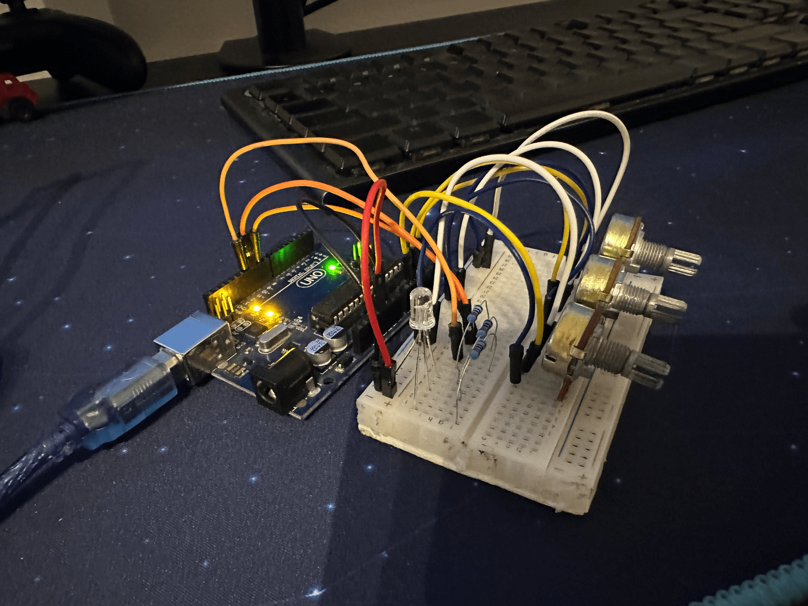
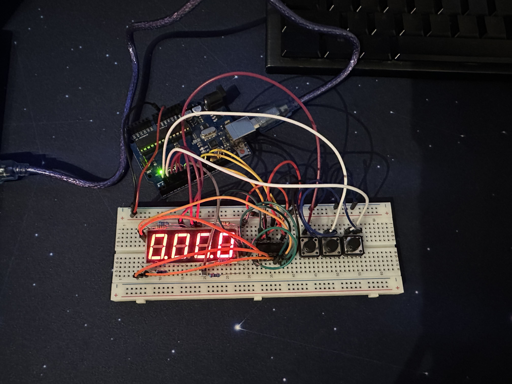
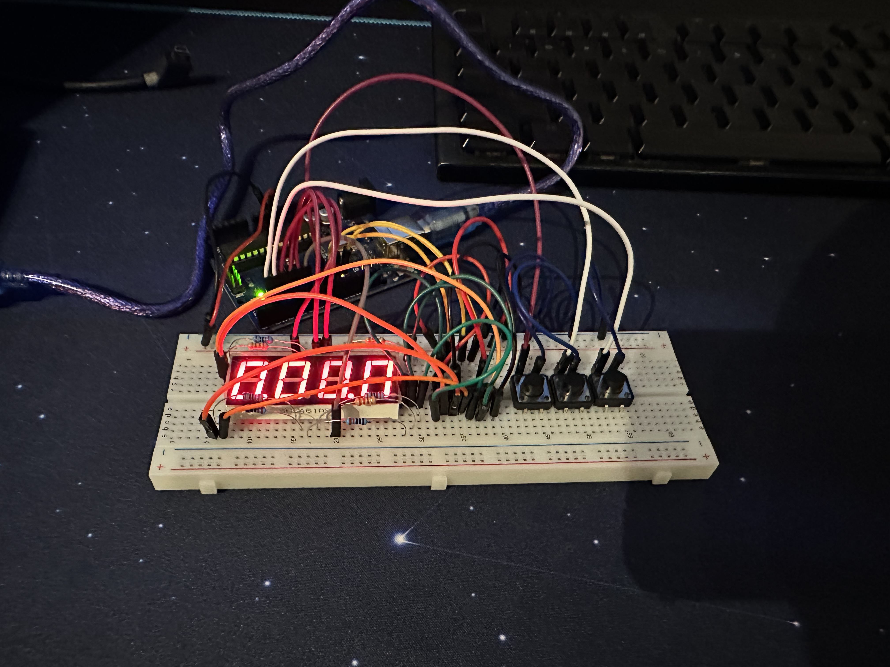
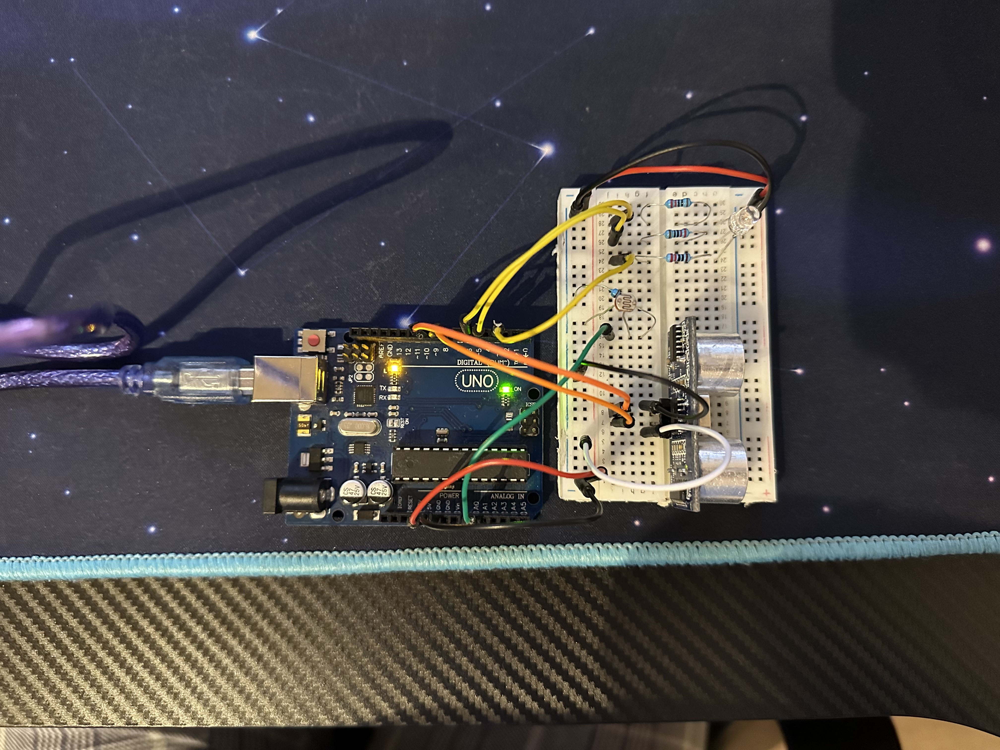
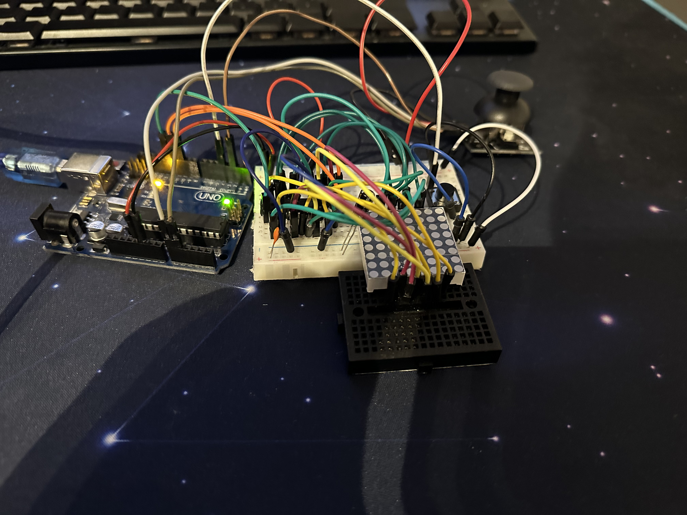
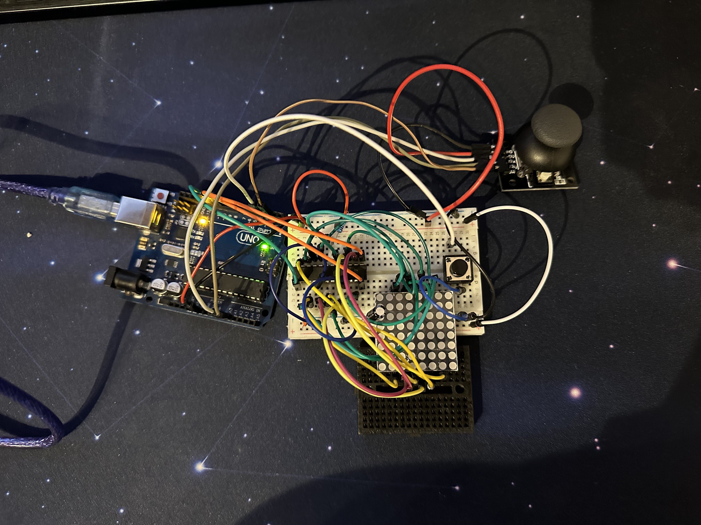
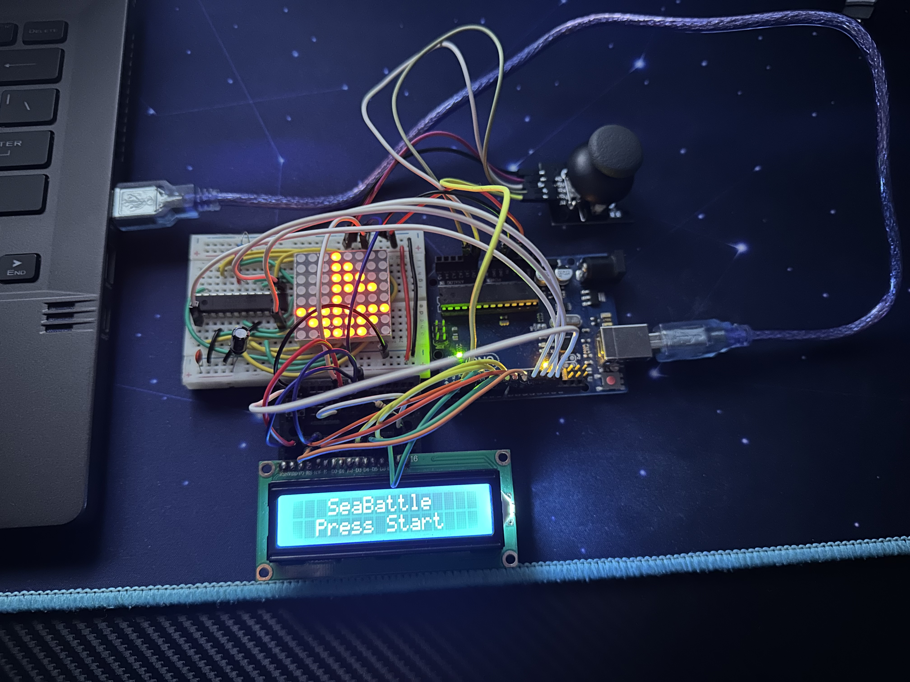

# IntroductionToRobotics
Bun venit în Repositoriul Cursului de Introducere in Robotica! 🤖✨ Aici vei găsi resurse esențiale pentru călătoria ta în lumea fascinantă a roboticii. Acest repository servește drept hub central pentru toate materialele, proiectele si temele de curs.

# Table of content
-[Tema1](#tema1)

-[Tema2](#tema2)

-[Tema3](#tema3)

-[Tema4](#tema4)

-[Tema5](#tema5)

-[Tema6](#tema6)

-[Tema7](#tema7)

# Tema1

## Requirement

Use a separate potentiometer for controlling each color of the RGB LED:Red,Green, andBlue.  This control must leveragedigital electronics.  Specifically,you  need  to  read  the  potentiometer’s  value  with  Arduino  and  then  write  amapped value to the LED pins.

## Photos

## Video

https://youtu.be/YgcXK1NC-ys

# Tema2

## Requirement

This  assignment  involves  simulating  a  3-floor  elevator  control  system  usingLEDs, buttons, and a buzzer with Arduino. By the end of this task, you will gainexperience in using button state change, implementing debouncing techniques,and coordinating multiple components to represent real-world scenarios.

## Photos

## Video

https://youtu.be/fLic0PvrlHc

# Tema3

## Requirement

The  initial  position  should  be  on  the  DP.  The  currentposition always blinks (irrespective of the fact that the segment is on oroff).  Use the joystick to move from one position to neighbors (see table forcorresponding movement).  Short pressing the button toggles the segmentstate  from  ON  to  OFF  or  from  OFF  to  ON.  Long  pressing  the  buttonresets the entire display by turning all the segments OFF and moving thecurrent position to the decimal point.

## Photos

## Video
https://youtu.be/SY8NlSZp4DU

# Tema4

## Requirement

Implement a stopwatch timer using a 4-digit 7-segment display and 3 buttons. The timer should count in 10ths of a second and include a lap-saving functionality. The starting value of the 4-digit 7-segment display should be "000.0". Button functionalities include starting/pausing (Button 1), resetting (Button 2, in pause mode) and saving laps (Button 3, in counting mode, up to 4 laps). During the timer counter, pressing the lap button should save that timer’s value in memory. In Pause Mode, the lap flag button doesn’t work, and pressing the reset button resets the timer to "000.0". After reset, pressing the flag buttons should cycle through the lap times, and continuous pressing should cycle through them continuously. Pressing reset in this state resets flags and the timer to "000.0".

## Photos

## Video
https://youtu.be/jn0bbRb7Vcg

# Tema5

## Requirement

Develop a ”Smart Environment Monitor and Logger” using Arduino.  This sys-tem will utilize various sensors to gather environmental data, log this data intoEEPROM, and provide both visual feedback via an RGB LED and user interac-tion through a Serial Menu.

## Photos

## Video

https://youtu.be/OL2FCrm9KL0

# Tema6

## Requirement

Develop a small game on the 8x8 matrix.  The game must have at least 3 typesof elements:  player (blinks slowly),  bombs/bullets (blinks fast),  wall (doesn’tblink). Thebasic idea is that you generate walls on the map (50% - 75% of the map) and thenyou move around with the player and destroy them.

## Photos

## Video

https://youtu.be/wu_5dZWaBuI

# Tema7

## Requirement

  The tasks include displaying an introductory message upon project startup, creating a menu with options to start the game, adjust settings (LCD and Matrix brightness control), and provide details about the game's creators. Additionally, students must implement an end message for when the game concludes, waiting for a user prompt before returning to the main menu. During gameplay, dynamic details like time, level, and lives should be displayed, and an end game/level functionality must be implemented.

## Photos

## Video

https://youtu.be/wu_5dZWaBuI
